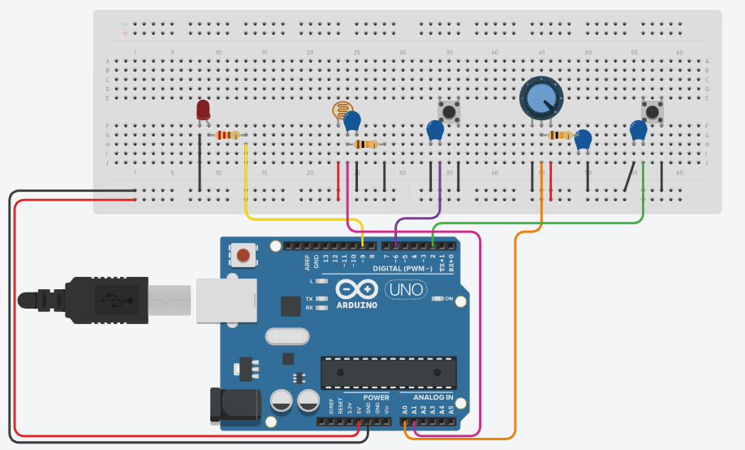

Sistema de Iluminación Multi-modo

Este es uno de mis primeros proyectos aplicando lo aprendido hasta el momento de filtros RC y debounce por software. La idea inicial fue crearle diferentes modos para poder medir y ver como a traves del filtro se atenúa el ruido

Modos de Operación:
1) Modo Manual: Control directo del brillo mediante un potenciómetro. 
2) Modo Automático: La intensidad se regula sola según la luz del ambiente (LDR). Tiene una función de calibración en tiempo real para adaptar el sensor a diferentes condiciones de luz.
3) Modo Progresivo: Una variación del manual donde el brillo no cambia bruscamente, sino que busca la posición del potenciómetro haciendo una transición suave.

Cosas que aprendí haciendo este código
    - Evitar rebotes implementando debounce tanto por hardware como por software, mediendo como se comportaban los botones en cada caso
    - Multitarea básica: Usar millis() para no tener que detener el procesador y que el sistema pueda leer el potenciometro mientras hace una transición del brillo
    - Manejo de señales: Mapear los valores que devuelve un sensor analógico para que coincidan con la potencia que soporta el LED mediante PWM.
    - Calibración: uso de constrain() si la fotorresistencia está mal calibrada o toma valores por fuera del rango en el que fue calibrada

Conexiones (Hardware)
    placa: Arduino Uno.
    Entradas: Potenciómetro, Fotorresistencia (LDR) y dos pulsadores.
    Salida: Un LED común con su resistencia

